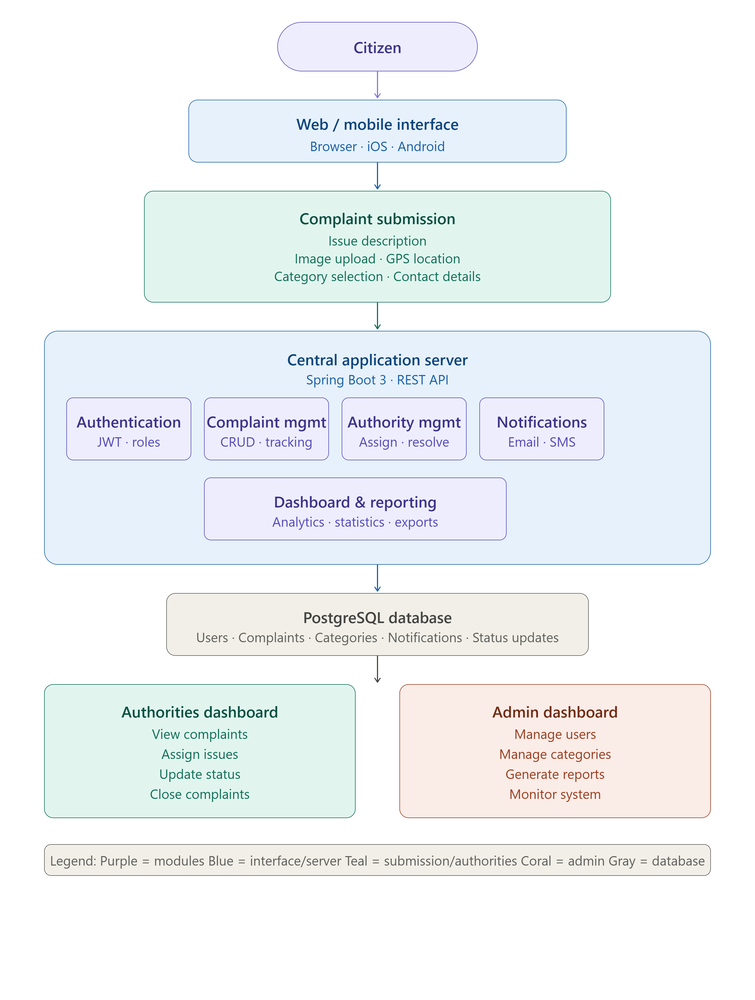
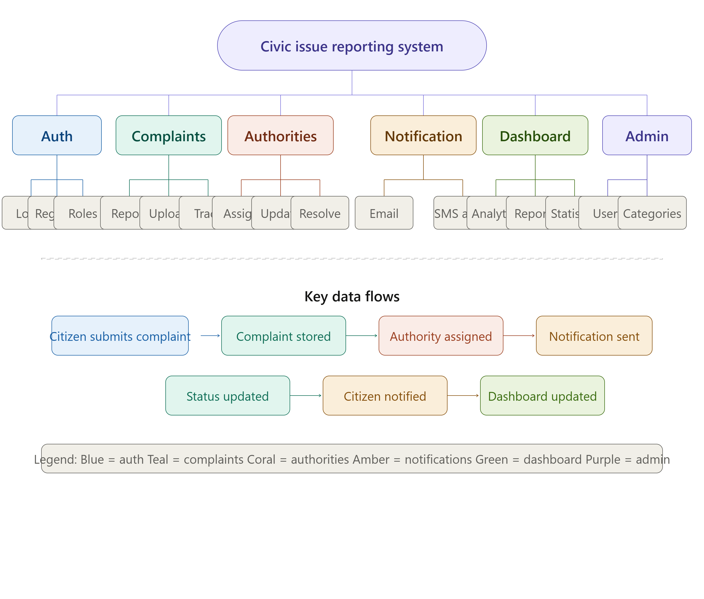
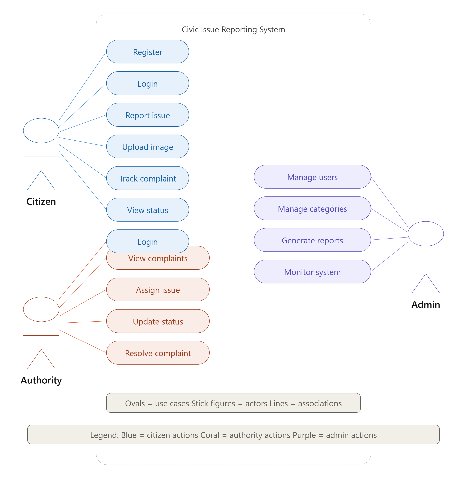
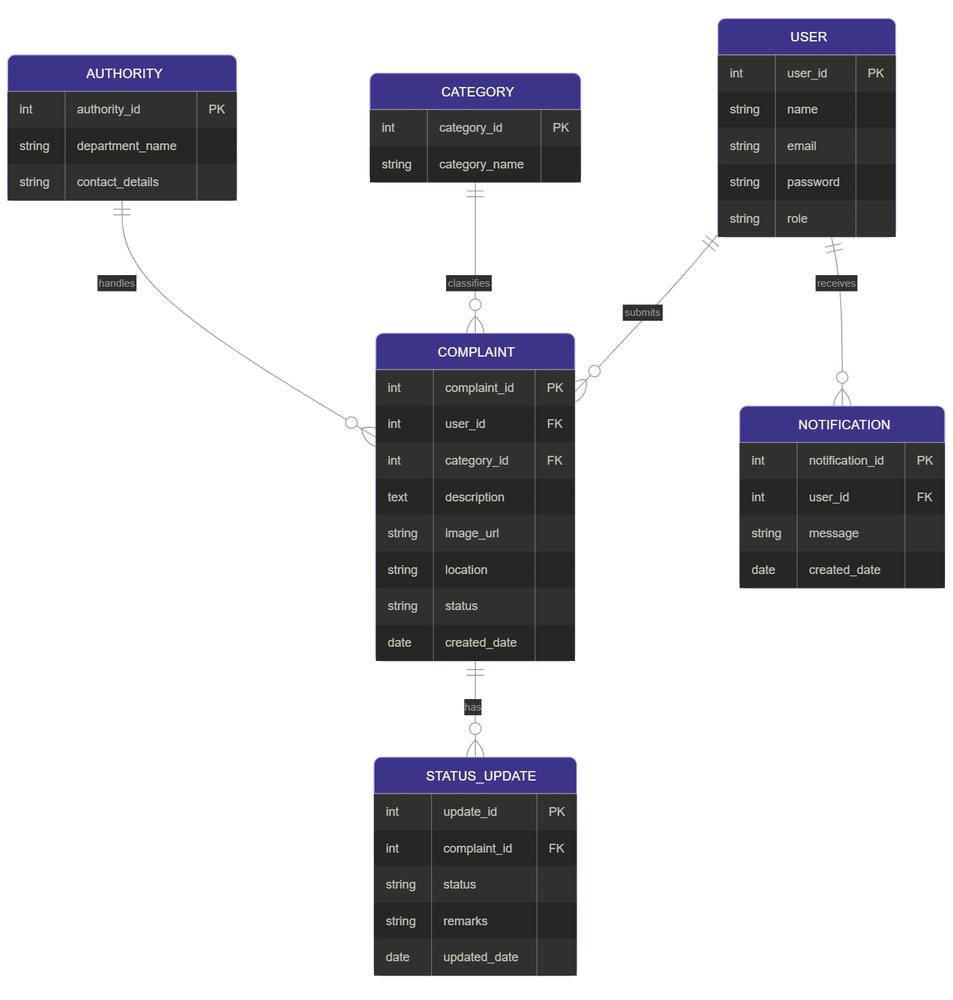

# Crowdsourced Civic Issue Reporting and Resolution System

---

# Project Overview

The Crowdsourced Civic Issue Reporting and Resolution System is a web-based platform that enables citizens to report public issues such as potholes, garbage accumulation, water leakage, damaged streetlights, drainage problems, and other civic concerns directly to responsible government authorities.

The system provides a centralized mechanism for issue submission, complaint tracking, authority management, and resolution monitoring. Citizens can upload issue details with supporting images and location information, while authorities can review complaints, update progress, and notify users regarding resolution status.

The platform improves transparency, accountability, and communication between citizens and local government departments.

---

# Objective

To develop a centralized Civic Issue Reporting and Resolution System that simplifies complaint management and improves public service delivery.

The system aims to:

- Enable citizens to report civic issues online.
- Provide image-based complaint submission.
- Allow authorities to manage complaints efficiently.
- Track complaint resolution status.
- Improve transparency and accountability.
- Reduce manual complaint handling.
- Generate reports for monitoring civic services.
- Enhance citizen engagement in governance.

---

# Problem Statement

Many civic issues remain unresolved because citizens lack an efficient platform to report problems directly to the concerned authorities.

Current complaint handling methods often result in:

- Delayed issue resolution.
- Lack of transparency.
- Poor communication between citizens and authorities.
- Difficulty in tracking complaint progress.
- Manual record maintenance.
- Duplicate complaints.
- Inefficient monitoring mechanisms.

The absence of a centralized complaint management system negatively impacts public service quality and citizen satisfaction.

This project addresses these challenges by providing a digital platform for reporting, monitoring, and resolving civic issues.

---

# User & Module Identification

The system is designed for Citizens, Government Authorities, and Administrators.

Users interact through a web-based platform to report civic issues, track complaint status, receive notifications, and manage issue resolution workflows.

---

# Modules List

- Authentication Module
- Complaint Management Module
- Category Management Module
- Authority Management Module
- Status Tracking Module
- Notification Management Module
- Dashboard & Reporting Module

---

# System Architecture

The system architecture illustrates the overall workflow of complaint reporting, complaint processing, authority management, and citizen notification services.

---

# Module Breakdown

The system is divided into multiple interconnected modules that collectively support complaint management and issue resolution.

### Authentication Module

- User Registration
- User Login
- Role-Based Access Control
- Secure Authentication

### Complaint Management Module

- Create Complaint
- Update Complaint
- View Complaint Details
- Complaint Tracking

### Category Management Module

- Manage Issue Categories
- Categorize Complaints
- Classification Management

### Authority Management Module

- Department Registration
- Authority Assignment
- Complaint Allocation

### Status Tracking Module

- Status Updates
- Resolution Monitoring
- Complaint History

### Notification Module

- User Notifications
- Status Alerts
- Resolution Updates

### Dashboard & Reporting Module

- Complaint Statistics
- Resolution Reports
- Performance Monitoring

---

# System Use Case Overview

The Use Case Diagram illustrates interactions between Citizens and Authorities within the Civic Issue Reporting System.

---

# Database Requirement Analysis

The system requires a centralized relational database to maintain complaint records, user details, issue categories, authority information, notifications, and status updates.

The database ensures efficient complaint tracking, authority assignment, and issue resolution monitoring.

---

# Table List

| Table Name | Description |
|------------|-------------|
| User | Stores user information |
| Complaint | Stores complaint details |
| Category | Stores complaint categories |
| Authority | Stores authority details |
| Status_Update | Stores complaint status history |
| Notification | Stores user notifications |

---

# Entity Relationship Diagram (ER Diagram)

The ER Diagram represents the relationships between users, complaints, categories, authorities, notifications, and complaint status updates.

---

# Database Entities

## User

- User ID
- Name
- Email
- Password
- Role

## Complaint

- Complaint ID
- User ID
- Category ID
- Description
- Image URL
- Location
- Status
- Created Date

## Category

- Category ID
- Category Name

## Authority

- Authority ID
- Department Name
- Contact Details

## Status Update

- Update ID
- Complaint ID
- Status
- Remarks
- Updated Date

## Notification

- Notification ID
- User ID
- Message
- Created Date

---

# Technology Stack

## Frontend

- HTML
- CSS
- Bootstrap
- JavaScript

## Backend

- Spring Boot (Java)

## Database

- PostgreSQL

## Development Tools

- VS Code
- GitHub
- Postman

---

# Future Enhancements

- Mobile Application Support
- GPS-Based Complaint Mapping
- AI-Based Issue Classification
- Multi-Language Support
- SMS Notifications
- Complaint Priority Prediction
- Real-Time Authority Dashboard
- Analytics and Reporting System

---

# License

This project is developed as part of the Smart India Hackathon (SIH) project preparation and academic learning activities.
